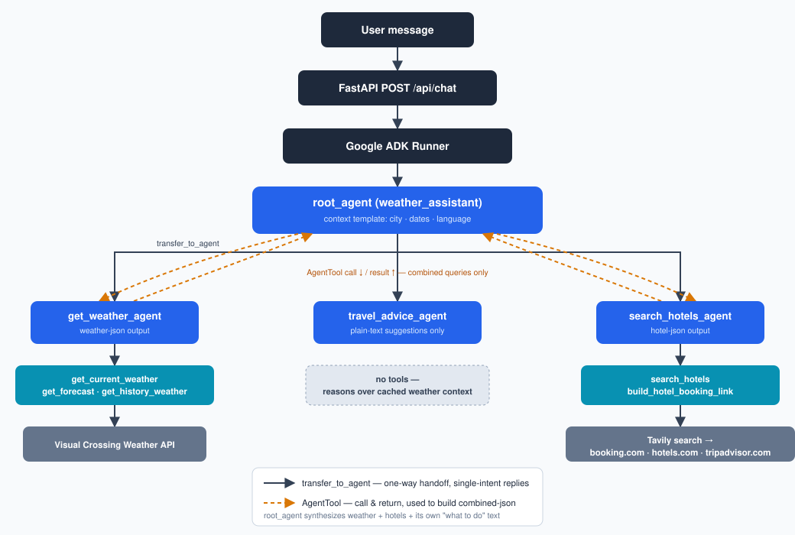
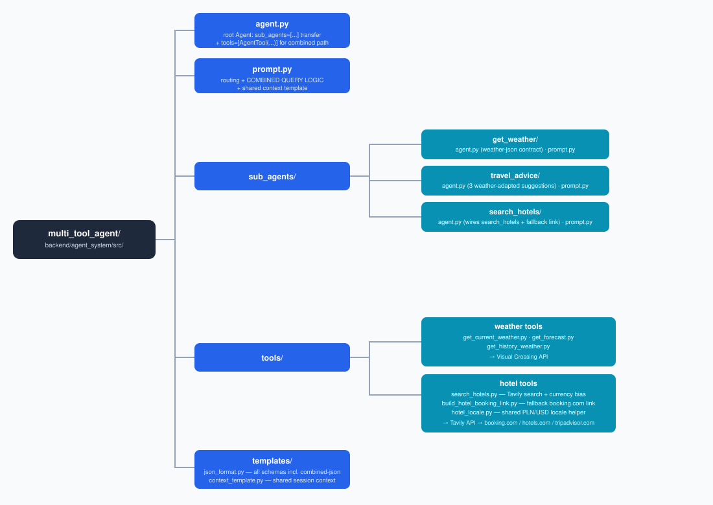
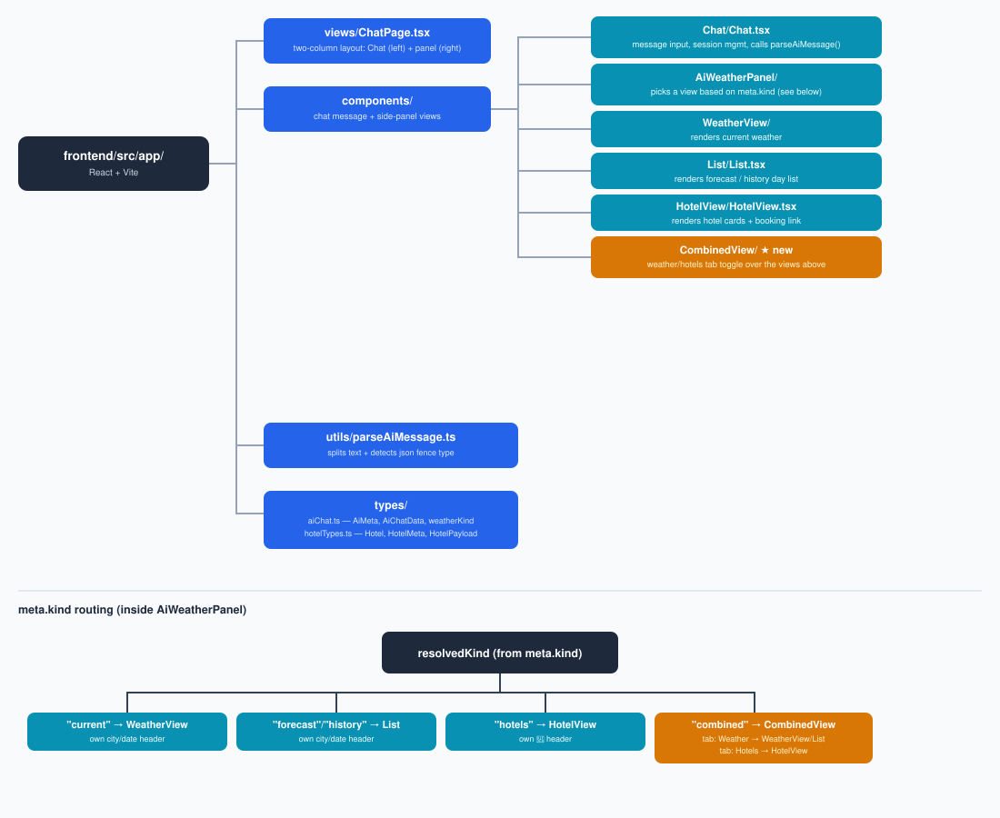

# Travel and Weather Center Chat

Travel and Weather Center Chat is a conversational assistant that combines **weather data**, **weather-aware travel advice**, and **hotel search**. Users chat naturally, and the app orchestrates a Google ADK multi-agent system to produce human-friendly responses paired with structured JSON payloads that drive the chat UI panels.

## Features

- **Current weather** — real-time conditions (temperature, wind, humidity, pressure, sunrise/sunset)
- **Weather forecast** — up to 15-day forecast for any city
- **Historical weather** — data for any past date range
- **Travel advice** — three weather-adapted activity suggestions for a city (outdoor vs indoor based on conditions)
- **Hotel search** — finds up to 3 hotels in any city via live web search (Tavily), returning price, rating, reviews and booking highlights

## AI Chat Flow

```
User message
    │
    ▼
FastAPI  /api/chat
    │
    ▼
Google ADK Runner  ──► root_agent (weather_assistant)
                            │
                    ┌───────┼───────────────┐
                    ▼       ▼               ▼
           get_weather  travel_advice  search_hotels
              _agent       _agent         _agent
                │                           │
          weather tools               Tavily search
    (Visual Crossing API)              (booking.com,
                                     hotels.com, etc.)
```

- The **root agent** maintains a per-session context template (city, date range, language) and routes to the correct child agent.
- It also recognizes whether a message is asking for a single piece of information (just weather, or just hotels) versus a combined request that needs the full sequence — in that case it calls the weather and hotel sub-agents one after another itself and merges their results into one reply.
- Every response returns a human-readable text block **plus** one fenced JSON block (`weather-json`, `hotel-json`, or `combined-json` for merged requests) that the frontend parses to render the side panel.
- The FastAPI layer validates the structured payload with Pydantic before sending it to the client.

**Visual overview:**



## Google ADK Agent Graph

```text
backend/agent_system/src/multi_tool_agent/
├── agent.py                          # root agent: sub_agents=[...] (transfer) + tools=[AgentTool(...)] (combined path)
├── prompt.py                         # routing logic, COMBINED QUERY LOGIC, shared context template
├── sub_agents/
│   ├── get_weather/
│   │   ├── agent.py                  # enforces weather-json output contract
│   │   └── prompt.py
│   ├── travel_advice/
│   │   ├── agent.py                  # suggests activities based on current weather
│   │   └── prompt.py
│   └── search_hotels/
│       ├── agent.py                  # calls Tavily, extracts hotel data, returns hotel-json
│       └── prompt.py
├── tools/
│   ├── get_current_weather.py        # Visual Crossing API — current conditions
│   ├── get_forecast.py               # Visual Crossing API — 15-day forecast
│   ├── get_history_weather.py        # Visual Crossing API — historical date range
│   ├── search_hotels.py              # Tavily web search — hotels in a city, currency-biased by language
│   ├── build_hotel_booking_link.py   # fallback booking.com link when Tavily has no direct hotel page
│   └── hotel_locale.py               # shared PLN/USD currency + locale helper
└── templates/
    ├── json_format.py                # all JSON output schemas (current/forecast/history/hotels/combined)
    └── context_template.py          # shared session context passed to all agents
```

**Visual overview:**



## JSON Output Schemas

All responses include one fenced JSON block. The frontend uses `meta.kind` to select the correct rendering panel.

### `weather-json` — weather and forecast data

**`kind: "current"`**
```json
{
  "meta": { "city": "Krakow", "kind": "current", "date": "2025-08-01", "date_range": null, "language": "en" },
  "current": {
    "temp": 22, "tempmax": 25, "tempmin": 16,
    "windspeed": 14, "winddir": 200, "pressure": 1012,
    "humidity": 60, "sunrise": "05:10", "sunset": "20:30",
    "conditions": "Partly cloudy"
  }
}
```

**`kind: "forecast"` / `kind: "history"`**
```json
{
  "meta": { "city": "Warsaw", "kind": "forecast", "date": null, "date_range": "2025-08-01..2025-08-15", "language": "pl" },
  "days": [
    { "datetime": "2025-08-01", "temp": 24, "tempmax": 27, "tempmin": 18, "windspeed": 10, "winddir": 180,
      "conditions": "Sunny", "sunrise": "05:20", "sunset": "20:10", "pressure": 1015, "humidity": 55 }
  ]
}
```

### `hotel-json` — hotel search results

**`kind: "hotels"`**
```json
{
  "meta": { "city": "Paris", "kind": "hotels", "date": null, "date_range": "2025-08-10..2025-08-17", "language": "en" },
  "hotels": [
    {
      "name": "Hotel Le Marais",
      "price_per_night": "145",
      "currency": "EUR",
      "availability": "available",
      "rating": 8.7,
      "reviews_count": 2340,
      "highlights": ["Central location", "Great breakfast", "Friendly staff"],
      "url": "https://www.booking.com/..."
    }
  ]
}
```

## Frontend Components

```text
frontend/src/app/
├── views/
│   └── ChatPage.tsx                  # two-column layout: Chat (left) + panel (right)
├── components/
│   ├── Chat/Chat.tsx                 # message input, session management, API calls
│   ├── AiWeatherPanel/               # right panel — switches view based on meta.kind
│   ├── WeatherView/                  # renders current weather data
│   ├── List/List.tsx                 # renders forecast / history day list
│   ├── HotelView/HotelView.tsx       # renders hotel cards (price, rating, highlights, booking link)
│   └── CombinedView/CombinedView.tsx # weather/hotels tab toggle for combined responses
├── utils/
│   └── parseAiMessage.ts             # splits human text from weather-json / hotel-json / combined-json fence
└── types/
    ├── aiChat.ts                     # AiMeta, AiChatData (current | days | hotels | weatherKind)
    └── hotelTypes.ts                 # Hotel, HotelMeta, HotelPayload
```

**Visual overview:**



The `AiWeatherPanel` uses `meta.kind` to decide which component to render:

| `meta.kind`          | Rendered component |
|----------------------|--------------------|
| `current`            | `WeatherView`      |
| `forecast`/`history` | `List`              |
| `hotels`             | `HotelView`         |
| `combined`            | `CombinedView` (tab toggle over the views above) |
| `travel_advice`      | *(text only)*      |

## Backend API

| Method | Path         | Description                          |
|--------|--------------|--------------------------------------|
| `POST` | `/api/chat`  | Send a message; returns `ChatResponse` |
| `GET`  | `/api/health`| Health check + env/service status    |

`ChatResponse` shape:
```json
{ "success": true, "data": { "message": "<text + fenced json>", "sender": "ai" }, "session_id": "..." }
```

## Example Conversations

**Weather:**
- "What is the current weather in Krakow?"
- "Show me the forecast for Paris for the next 7 days."
- "What was the weather in London last week?" *(asks for date range)*

**Travel advice** *(two-step)*:
1. "What is the current weather in Lisbon?"
2. "Given this weather, what are three things worth visiting?" → `travel_advice_agent` uses the cached weather context

**Hotel search:**
- "Find hotels in Rome"
- "Search for hotels in Warsaw for August 10–17"
- "Znajdź hotele w Krakowie na przyszły tydzień"

## Environment Variables

| Variable                  | Required | Description                                  |
|---------------------------|----------|----------------------------------------------|
| `GOOGLE_API_KEY`          | ✅       | Google Generative AI key for ADK agents      |
| `VISUAL_CROSSING_API_KEY` | ✅       | Visual Crossing Weather API key              |
| `TAVILY_API_KEY`          | ✅       | Tavily search API key (hotel search)         |
| `MODEL`                   | optional | Gemini model ID (default: `gemini-2.5-flash`)|
| `PUBLIC_WEB_ORIGIN`       | optional | Public domain added to CORS allowed origins  |
| `ENVIRONMENT`             | optional | Set to `production` to enforce required vars |

Get your free Tavily key at [tavily.com](https://tavily.com) — the free tier provides 1000 requests/month.

### Tavily

**How it works.** Tavily is a web-search API built for AI agents: instead of HTML with links, it returns JSON with relevance-ranked text snippets extracted from the pages themselves, ready to drop into an LLM context. Crucially, Tavily knows nothing about hotels — it returns raw page text, and turning that text into structured hotel data is the LLM's job.

The request sent by `search_hotels`:

```python
client.search(
    query=query,                  # language-matched, e.g. "hotels in Warsaw ... price per night USD rating reviews booking"
    search_depth="advanced",      # deeper crawl, better snippets (2 credits instead of 1)
    max_results=8,
    include_domains=["booking.com", "hotels.com", "tripadvisor.com"],
    country=locale["country"],    # "poland" / "united states" — geo hint for the search
)
```

Each entry in the returned `results` list has four fields:

| Field     | Meaning                                                                     |
|-----------|-----------------------------------------------------------------------------|
| `title`   | Page title                                                                  |
| `url`     | Page address                                                                |
| `content` | Extracted page text — where price/rating/reviews live, if the snippet caught them |
| `score`   | Tavily's 0–1 relevance score                                                |

Before handing results to the agent, the tool post-processes them: `_force_currency` appends `selected_currency`/`lang` to booking.com links so the page opens in a consistent currency, and `_is_direct_hotel_url` flags links that point at a single property page (`/hotel/pl/xyz.html`) rather than a city overview, sorting direct pages first. The full chain is: user message → agent → tool → Tavily (snippets) → tool (currency + sorting) → LLM extracts `hotel-json` → Pydantic validator → `HotelView`.

**Why currency handling is hard.** `search_hotels` has no hotel database of its own — it queries Tavily's web search API against booking.com, hotels.com and tripadvisor.com and returns raw scraped snippets for the `search_hotels_agent` LLM to extract into structured data. Tavily's cached page snapshots can carry whatever currency/locale its crawler happened to see (we observed the same city returning prices in USD, INR, BYN, MXN, etc. across runs), so the tool now takes a `language` argument (the chat's detected language from the shared CONTEXT TEMPLATE) and picks a single target currency from it — `PLN` for Polish, `USD` otherwise — which it uses to bias the Tavily query/`country` hint and to force `selected_currency`/`lang` on every returned booking.com link. The agent prompt is instructed to only report a price when the scraped content actually shows that target currency, leaving `price_per_night` empty rather than mislabeling a foreign-currency figure.

## Local Development

Requirements: Python 3.12 with `uv`, Node.js 18+.

```bash
# 1. Backend
cd backend
uv sync                              # installs all deps including tavily-python
source ../env-scratchpad.sh          # exports GOOGLE_API_KEY, VISUAL_CROSSING_API_KEY, TAVILY_API_KEY
uv run uvicorn api.main:app --reload --port 8000

# 2. Frontend (new terminal)
cd frontend
npm install
export VITE_BACKEND_API_URL=http://localhost:8000
npm run dev

# App: http://localhost:5173
# API: http://localhost:8000/api/health
```

## Docker (single container)

```bash
source env-scratchpad.sh
./deploy-production.sh
```

Builds a multi-stage image (backend + Vite frontend), starts Nginx on port 80 and proxies `/api/*` to FastAPI.

```bash
curl http://localhost/api/health
```
